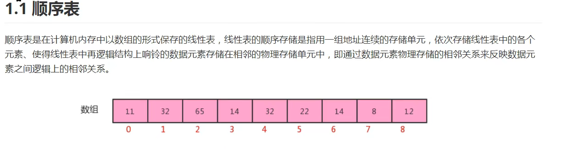
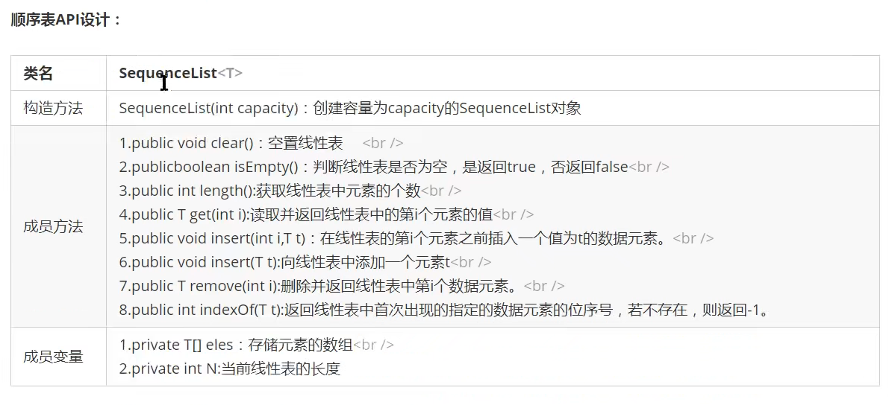

 # SequenceList顺序表（数组实现）
 
 
 ## 知识点一：
这里`public class SequenceList<T> {`
使用泛型
这里定义泛型是用来存储任意类型。

假定我们有这样一个需求：写一个排序方法，能够对整型数组、字符串数组甚至其他任何类型的数组进行排序，该如何实现？
答案是可以使用 **Java 泛型**。

https://www.runoob.com/java/java-generics.html
## 知识点二：
`this.eles = (T[])new Object[capacity];`
这里是初始化数组操作。我们可能会写成 `this.eles = new T[capacity];`
但其实这么做是不对的，会被报错。这里