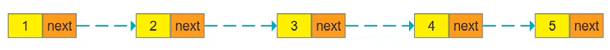

# 链表反转（Leetcode，206）
## 题干
给你单链表的头节点 head ，请你反转链表，并返回反转后的链表。

**示例1：**

> 输入：head = [1,2,3,4,5]

> 输出：[5,4,3,2,1]

**示例2：**

>输入：head = [1,2]

>输出：[2,1]

**示例3：**

>输入：head = []

> 输出：[]

**提示：**
- 链表中节点的数目范围是 [0, 5000]
- -5000 <= Node.val <= 5000

**进阶：** 链表可以选用迭代或递归方式完成反转。你能否用两种方法解决这道题？

## 解答
## 方案一：递归

- 将后一项的节点的next域指向前一个节点的地址

    >Next n = (n-1) 
- 在将前一项的next域（原本指向后一项节点的地址）清空

    >Next n-1 = null`
- 注意：在正序递归过程中，进行前一项next清零，会将上一递归周期中前一项已反转连接好的next域的值清理掉，所以，整个过程需要我们进行 **逆向递归**。

## 方案二：